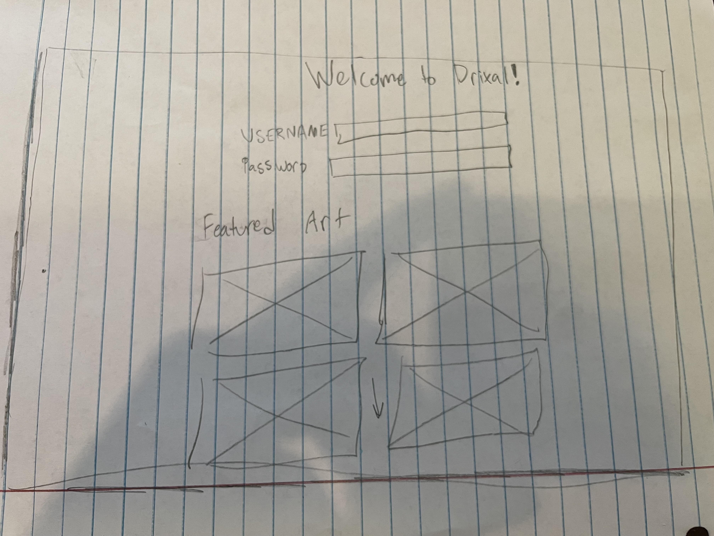
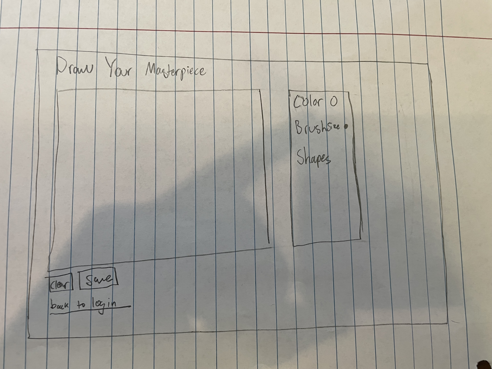

# Drawing Game Website Specification

## Elevator Pitch

This webiste is a drawing application that allows users to draw, create and save their masterpieces! This makes it simple to save and simple to draw, no fancy tools just use your imagination! You can also view art from the community and see what other people are doing! 

## Key Features

 and play back their drawings as animated stories.
- **User Authentication:** Users can create accounts, log in, and have their profiles displayed.
- **Community Gallery:** A gallery where users can view and like other users' drawings.
- **Real-Time Interaction:** Using WebSockets, users can collaborate on drawings in real-time.
---

## Technology Specification

### **HTML**

- Basic structural elements for the website including a navigation bar, login form, drawing canvas, and gallery pages.
- Two main pages:
  - **Home Page:** Includes the drawing canvas and tool selection.
  - **Gallery Page:** Displays drawings from the community.

### **CSS**

- Responsive design to ensure the site looks great on all devices.
- Styling for buttons, forms, canvas, and animations.
- Smooth transitions and animations for UI interactions, such as tool selection and gallery transitions.

### **JavaScript**

- Handles interactivity such as:
  - Drawing on the canvas.
  - Playing back recorded drawings.
  - Saving drawings to the backend.
  - User login/logout.
  - Form validation.

### **React**

- Single Page Application with the following components:
  - **NavBar Component:** Contains links to Home, Gallery, and Profile.
  - **Canvas Component:** The drawing tool.
  - **Gallery Component:** Displays community drawings.
  - **Profile Component:** Shows user information and past drawings.
  - Routing using React Router for seamless navigation.

### **Web Service**

- **Custom Backend Services:**
  - `saveDrawing()`: Saves user drawings to the database.
  - `getGalleryDrawings()`: Fetches drawings for the gallery.
  - `getUserProfile()`: Fetches user profile data.
- **Third-Party API:**
  - Using [Unsplash API](https://unsplash.com/developers) to provide users with background images to draw on.

### **Authentication**

- **User Registration and Login:**
  - Users can sign up and log in using email and password.
  - Display the logged-in user’s name on the navbar.

### **Database Data**

- **Database Structure:**
  - **Users Table:** Stores user credentials and profile data.
  - **Drawings Table:** Stores user-generated drawings and associated metadata.
  - **Gallery Table:** Stores public drawings for the community gallery.

### **WebSocket Data**

- Real-time collaboration feature:
  - Users can invite friends to collaborate on a drawing in real-time.
  - WebSocket sends drawing updates to connected users.
- **Real-time Gallery Updates:**
  - When a user uploads a drawing, it immediately appears in the community gallery for all users.

---

## Example Design Images

**Home Page Wireframe:**

-  

**Gallery Page Wireframe:**

- 

---

## Summary

This drawing game website will utilize modern web technologies to provide users with a fun, interactive, and community-driven platform. By integrating real-time features and third-party services, it ensures a dynamic experience for all users. The application will be built with scalability, security, and usability in mind.

## Notes

## startup
This is for BYU CS260

### IP and Domain Stuff
- I have an elastic ip address for the website
- I need to buy a domiain

### Learning how to Deploy Online
- This is Important: ./deployFiles.sh -k ~/keys/production.pem -h yourdomain.click -s startup
- This is the version I use for simon: ./deployFiles.sh -k ~/Documents/cs260/keys/production.pem -h getdrixal.com -s simon
- This command is import when deploying files as well. scp -i ~/Documents/cs260/keys/production.pem draw.ht
ml ubuntu@getdrixal.com:/home/ubuntu/public_html/startup
draw.html

### React Notes and Changes

So I need to take notes on what I am doing so they see that I am not cheating. Basically what I am going to be doing is doing what I did on simon-css and do it on my application. I will create an individual file for each of the pages and create a react component. On the main app.jsx I will have a route that goes between each of the pages. 

### HTML Notes

- I added three pages the login, draw, and gallary. Login is going to be the initial page, draw will be where the user is most frequently, and gallary will be where the images are stored.
- Other than the pages it is not that complicated. Just some buttons and text and then placeholders for everything else. I will have to figure out later how I am going to implement drawing

### CSS Notes
- I wanted to go with a pink color scheme for this app just because it is relaxing. I don't know if I like it a whole lot but I am just going for it now.
- Flexboxes are awesome and make it way easier for the page to be dynamic
- Found some cool css you could do on hover states which is in the app right now. You can do it without implementing react
- I don't like using grid, flexboxes all the way
- 

### React Part 1
- This part was pretty simple the only thing that was annoying was that I had to restyle everything for some reason. I think I had too many style sheets was the issue but I was able to get it fixed.
- I used pretty much the same method that was employed in the simon project. I did have to add a navbar though so it would work properly. Before all my links were just scattered all over

### React Part 2
- I am lost
- This is the point I got to in the class that I didn't know. Everything else so far I have done except the deploying and AWS but that was pretty simple
- We will see how it goes
- I finally Got Simon React part 2 deployed and that is really helpful
- I don't know exactly what to do for my application but I am going to try.
- I first added the login stuff. All it does is it checks if the user name and password are filled in and if they are then the user can access the other places. The gallery and draw features are hidden until they do that.
- The draw feature works. I needed a lot of help with it and it is definately the most complicated thing that I did but it works. It's a little buggy but it is good enough for the first version
- I was initially going to not touch the gallary but a figured out how to save the images to the gallery using local storage. It works really well right now and the styling is way better than I expected. 

### Startup Service
- Well I feel lost again but not as lost as functionality
- I got a lot to learn I think the examples were pretty goo
- The most important thing is the login, I am going to take a look at the login code for simon and see how I can impliment it into my system.
- Startup goes on 4000 simon goes on 3000
- I did it!!! I finally Did it! I got my backend connected to my frontend. I knew my backend was working because I tested it with the curl commands but it was taking me so long to get my backend to work. I realized my links were off. Then I fixed the routing and it finally worked. Then I had a problem with the logout I could get it to work. Then I realised that it was because I was using a post command and not a delete command.
- create - put
- login - post
- logout - delete
- I finally finished! I got everything working on deployment. The issue was I had a didn't install cors in my backend and that was causing problems
- Deliverables: Call third party(The cs260 api because I couldn't think of anything else), express(express and the middleware are used in my index.js file), api and endpoints(login, register, and logout are the endpoints and they connect throuht the front end and work good enough.)

### Startup DB
- Did the simon version and that was pretty simple. All I had to do was add my credentials
- Adding the users to the data base wasn't too bad it was pretty similar code to the the example simon
- It took me a while but I figured out how to save the images to the database.
- I might work on retreving them later when I implement websockets
- Now I just need to upload this to the ssh
- Deliverables: Put users in database check
- Deliverables: Put application data in the database check(I store image urls in there)

### Startup Websocket
- I did not understand this for a while
- Super confused
- I got a test websocket working that is similar to the 
- All I want to do is send a message over the websocket if someone is drawing. I want to keep it simple
- My websocket needs to be opened on the same port as my backend I think
- Yeah that is true
- Websocket is buggy
- Fixed it I had the 'Some one is drawing in the wrong function'
- Deliverable: My beckend listens for the websocket
- Deliverable: My Frontend makes Websocket Conntection
- Deliverable: Data is sent over - it sends if a user is drawing on the canvas
- Deliverable: It displays it in the draw part of the application.